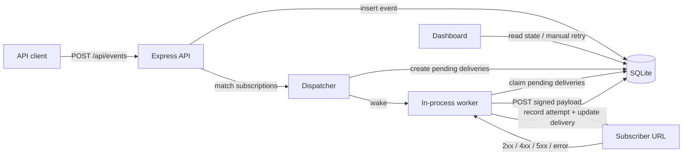
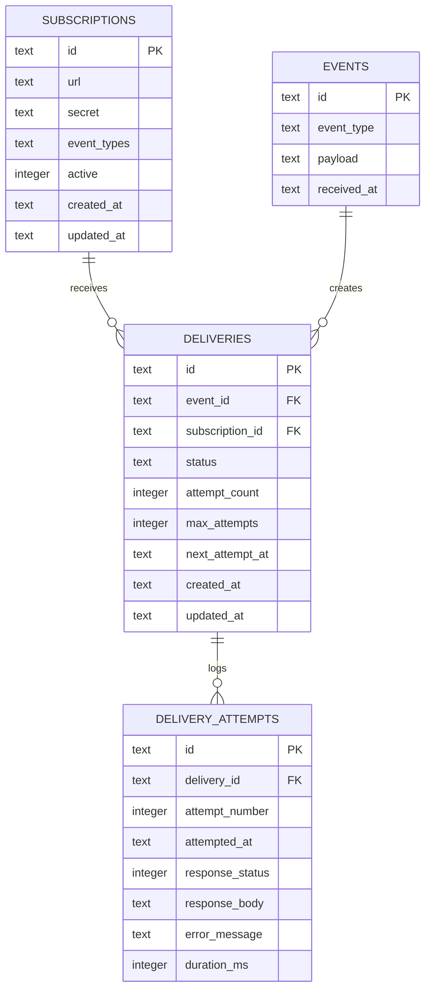
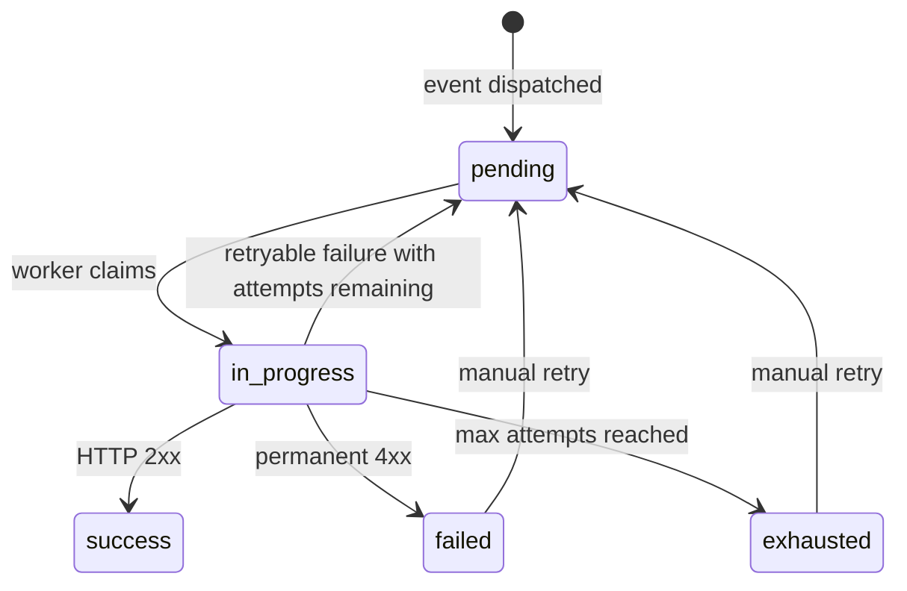

# Webhook Delivery Service

A single-process webhook delivery service built with TypeScript, Express, and SQLite. Clients register webhook subscriptions, ingest events, and the service fans matching events out to subscriber URLs with retries, persistent delivery state, immutable attempt logs, HMAC signing, and a plain server-rendered dashboard.

The implementation favors completeness over breadth: retries genuinely retry, delivery attempts are durable, interrupted in-flight work is recovered on restart, and the dashboard reads from the same state the worker uses.

## Quick Start

```bash
npm install
npm run dev
# Open http://localhost:3001
```

After dependencies are installed, `npm run dev` is the single-command local run path. For a production-style check before submission:

```bash
npm run build
npm start
# Open http://localhost:3001
```

Requirements:

- Node.js 18+
- SQLite 3.35.0+ through `better-sqlite3`

SQLite 3.35.0+ is required because the worker uses `UPDATE ... RETURNING` to atomically claim pending deliveries. The app checks the SQLite version on startup and fails fast with a clear error if it is too old.

## What It Does

- Creates webhook subscriptions with a target URL, optional shared secret, and event type filters.
- Ingests events through an authenticated API.
- Matches events to active subscriptions and creates one delivery per event-subscription pair.
- Delivers webhooks over HTTP with HMAC signatures when a secret is configured.
- Retries retryable failures with exponential backoff and jitter.
- Persists subscriptions, events, delivery state, and every delivery attempt to SQLite.
- Recovers `in_progress` deliveries on startup for at-least-once delivery semantics.
- Provides a dashboard for subscriptions, events, delivery attempts, and manual retry.
- Treats subscription secrets as write-only in public API and dashboard responses.

## Architecture



All runtime components live in one Node.js process:

- `src/index.ts` initializes the database, runs recovery, starts Express, and starts the worker.
- `src/api/*` exposes the JSON API behind `X-API-Key`.
- `src/worker/*` handles dispatching, retry policy, claiming, and HTTP delivery.
- `src/models/*` is the SQLite data access layer.
- `src/dashboard/*` renders server-side HTML pages.

## Data Model



`deliveries` is the mutable state machine used by the worker. `delivery_attempts` is append-only audit history and is never deleted during manual retry.

## Delivery State Machine



Manual retry is only allowed for `failed` and `exhausted` deliveries. It resets `attempt_count` to `0` and sets `next_attempt_at` to now, while preserving all previous attempt rows. Attempt numbers are therefore per automatic retry cycle; after a manual retry, the dashboard may show a new `#1` attempt after older attempt rows.

## Retry And Failure Rules

| Outcome | Result |
|---|---|
| `2xx` response | Mark delivery `success` |
| `400`, `401`, `403`, `404`, `405`, `406`, `410`, `422` | Mark delivery `failed` |
| `408`, `429` | Retry |
| `5xx` | Retry |
| Network error or timeout | Retry |

Retry delay uses exponential backoff with jitter:

```text
delay = min(baseDelay * multiplier^attemptNumber, maxDelay) +/- jitter
```

Defaults:

- max attempts: `5`
- base delay: `1000ms`
- multiplier: `2`
- max delay: `3600000ms`
- jitter factor: `0.25`

## At-Least-Once Delivery

The service provides at-least-once delivery, not exactly-once delivery.

If the process crashes after a subscriber receives a request but before the service persists `success`, that delivery may be sent again after restart. On startup, any stale `in_progress` delivery is moved back to `pending` and becomes eligible for retry. Subscribers should deduplicate using the `X-Webhook-ID` header, which is the event ID.

## Payload Signing

When a subscription has a `secret`, deliveries include:

```text
X-Webhook-ID: <event_id>
X-Webhook-Timestamp: <unix_timestamp_seconds>
X-Webhook-Signature: sha256=<hex_digest>
Content-Type: application/json
```

The signature is computed over the exact JSON string sent on the wire:

```text
signed_content = "<timestamp>.<raw_json_body>"
signature = HMAC_SHA256(secret, signed_content)
```

Subscribers should verify against the raw request body, not a parsed and re-serialized object, because JSON formatting or key order can change.

Subscription secrets are accepted on create and stored for signing, but public subscription responses expose only `hasSecret: true` instead of returning the secret value.

## Event Matching

Supported subscription patterns:

| Event type | Pattern | Match |
|---|---|---|
| `order.created` | `order.created` | yes |
| `order.created` | `order.*` | yes |
| `order.updated` | `order.*` | yes |
| `order.item.added` | `order.*` | no |
| `anything.here` | `*` | yes |
| `order.created` | `order*` | no |

Only exact matches, `*`, and single-level suffix wildcards like `order.*` are supported.

## API Reference

All `/api/*` endpoints require:

```text
X-API-Key: dev-api-key
```

Set `ADMIN_API_KEY` to change the default.

### Subscriptions

Create a subscription:

```bash
curl -X POST http://localhost:3001/api/subscriptions \
  -H "Content-Type: application/json" \
  -H "X-API-Key: dev-api-key" \
  -d '{"url":"http://localhost:4000/webhook","secret":"test-secret","eventTypes":["order.*"]}'
```

Other subscription endpoints:

| Method | Path | Description |
|---|---|---|
| `GET` | `/api/subscriptions` | List active subscriptions |
| `GET` | `/api/subscriptions/:id` | Get one subscription |
| `DELETE` | `/api/subscriptions/:id` | Deactivate a subscription |

### Events

Ingest an event:

```bash
curl -X POST http://localhost:3001/api/events \
  -H "Content-Type: application/json" \
  -H "X-API-Key: dev-api-key" \
  -d '{"eventType":"order.created","payload":{"orderId":"123","amount":99.99}}'
```

Other event endpoints:

| Method | Path | Description |
|---|---|---|
| `GET` | `/api/events` | List events with delivery summaries |
| `GET` | `/api/events?eventType=order.created` | Filter events by type |
| `GET` | `/api/events/:id` | Get one event with delivery summary |
| `GET` | `/api/events/:eventId/deliveries` | List deliveries and attempt history for an event |

### Deliveries

Manually retry a failed or exhausted delivery:

```bash
curl -X POST http://localhost:3001/api/deliveries/<delivery_id>/retry \
  -H "X-API-Key: dev-api-key"
```

Retry responses:

- `200` if the delivery was re-queued.
- `404` if the delivery does not exist.
- `409` if the delivery is `pending`, `in_progress`, or `success`.

## Dashboard

Open:

```text
http://localhost:3001
```

Dashboard pages:

- `/` lists active subscriptions and includes a create subscription form.
- `/events` lists ingested events with delivery summaries.
- `/events/:id` shows event payload, matching deliveries, attempt history, and retry buttons.

Dashboard routes are intentionally unauthenticated because this is a local take-home service. Browser forms call dashboard routes directly rather than `/api/*`, because plain HTML forms cannot attach the custom `X-API-Key` header.

## Demo Flow

Terminal 1: start the main service.

```bash
npm run dev
```

Terminal 2: start the local receiver.

```bash
RECEIVER_SECRET=test-secret npm run receiver
```

Terminal 3: create a subscription and send an event.

```bash
curl -X POST http://localhost:3001/api/subscriptions \
  -H "Content-Type: application/json" \
  -H "X-API-Key: dev-api-key" \
  -d '{"url":"http://localhost:4000/webhook","secret":"test-secret","eventTypes":["order.*"]}'

curl -X POST http://localhost:3001/api/events \
  -H "Content-Type: application/json" \
  -H "X-API-Key: dev-api-key" \
  -d '{"eventType":"order.created","payload":{"orderId":"123","amount":99.99}}'
```

Open `http://localhost:3001/events` to inspect delivery state and attempt history.

To demo retries, start the receiver with a failing status:

```bash
RECEIVER_STATUS=500 npm run receiver
```

## Development

```bash
npm run dev        # start service with hot reload
npm run receiver   # start local webhook receiver on port 4000
npm run build      # compile TypeScript to dist/
npm start          # run compiled app
npm test           # run all tests
npm run test:unit  # unit tests
npm run test:int   # integration tests
```

Integration tests start local Express servers on random loopback ports and use an in-memory SQLite database.

## Environment Variables

| Variable | Default | Description |
|---|---:|---|
| `PORT` | `3001` | Main service port |
| `ADMIN_API_KEY` | `dev-api-key` | Required for `/api/*` routes |
| `DB_PATH` | `./data/webhooks.db` | SQLite database file path |
| `WORKER_POLL_MS` | `1000` | Worker fallback polling interval |
| `WORKER_BATCH_SIZE` | `10` | Number of deliveries claimed per tick |
| `WORKER_CONCURRENCY` | `10` | Max concurrent outbound HTTP deliveries |
| `RETRY_MAX_ATTEMPTS` | `5` | Max automatic attempts before exhausted |
| `RETRY_BASE_DELAY_MS` | `1000` | Base retry delay |
| `RETRY_MAX_DELAY_MS` | `3600000` | Maximum retry delay |
| `RETRY_BACKOFF_MULTIPLIER` | `2` | Exponential backoff multiplier |
| `RETRY_JITTER_FACTOR` | `0.25` | Random jitter as a fraction of delay |
| `DELIVERY_TIMEOUT_MS` | `30000` | Outbound HTTP timeout |
| `JSON_BODY_LIMIT` | `1mb` | Max JSON request body size |
| `RECEIVER_PORT` | `4000` | Local receiver port |
| `RECEIVER_STATUS` | `200` | Local receiver response status |
| `RECEIVER_SECRET` | unset | Local receiver HMAC verification secret |

`cors()` is intentionally open for local development and take-home testing. In production, allowed origins should be restricted.

## Project Structure

```text
src/
  api/             JSON API routes and request validation
  dashboard/       server-rendered dashboard routes/templates/styles
  db/              SQLite connection and schema initialization
  middleware/      API key middleware
  models/          data access functions
  signing/         HMAC helpers
  utils/           pattern matching and timestamp helpers
  worker/          dispatcher, retry policy, delivery worker
  index.ts         application entrypoint
  receiver.ts      local demo receiver
tests/
  unit/            pure unit tests
  integration/     API and worker integration tests
```

## Verification

Current automated coverage focuses on the critical paths:

- pattern matching
- retry classification and backoff
- HMAC signing
- API authentication and validation
- subscription CRUD
- event ingest and delivery queueing
- successful webhook delivery
- retryable `500` responses
- permanent `400` responses
- startup recovery of stale `in_progress` deliveries

Run:

```bash
npm run build
npm test
```

## What Works

- Persistent subscriptions, events, deliveries, and attempt logs in SQLite.
- Pattern matching with exact, catch-all, and single-level wildcard patterns.
- In-process worker with atomic claiming, retries, backoff, HMAC signing, and startup recovery.
- Dashboard pages for subscriptions, events, event details, attempts, and manual retries.
- Local receiver for demos and automated unit/integration coverage.

## Known Scope Choices

- No real auth, multi-tenancy, or RBAC. API routes use one shared admin key.
- No distributed workers. This is intentionally one process.
- No subscription update endpoint. Delete and recreate subscriptions instead.
- Dashboard is plain server-rendered HTML rather than a separate frontend app.
- No rate limiting per subscriber yet, though jitter reduces synchronized retry bursts.

## What I'd Improve With More Time

- Event and delivery TTL cleanup.
- Subscription `PATCH` endpoint.
- Dead-letter view/filter for exhausted deliveries.
- Rate limiting per subscriber.
- Key rotation for HMAC secrets.
- Structured logging, metrics, and tracing.
- WebSocket updates for the dashboard.
